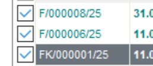
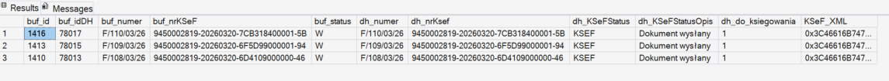
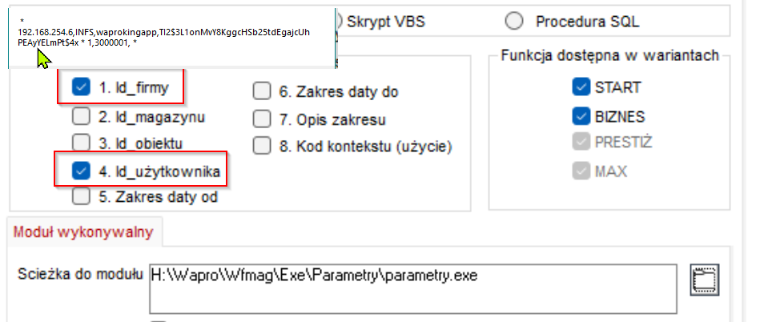
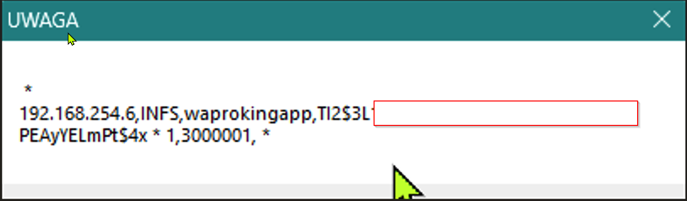

# Integracja z KSeF — opis struktury danych

## baza demo

[Dysk google](https://drive.google.com/file/d/1Q3G9eT2g8L9IUsZr8jMGrSa9wvhCe7bw/view?usp=drive_link)  
spakowana zip bez hasła  
SQL2019

## Struktura tabel

- `[BUF_DOKUMENT]`- pełni rolę bufora dokumentów przygotowanych do wysyłki do KSeF. Jest ona powiązana z:
- `[BUF_ZALACZNIK]` — przechowuje załącznik w formacie XML zgodnym z KSeF,
- `[DOKUMENT_HANDLOWY]` — tabela źródłowa dokumentu handlowego w systemie.

---

## Scenariusz działania

### 1. Wybór dokumentów przez użytkownika

Użytkownik w module dokumentów handlowych zaznacza dokumenty, które mają zostać wysłane do KSeF.



Zaznaczone pozycje są zapisywane w tabeli `[ZAZNACZONE]` i można je odczytać zapytaniem:

```sql
SELECT ID FROM ZAZNACZONE WHERE ID_SESJI = 3000001
```

> `ID_SESJI` odpowiada ID zalogowanego pracownika — wartość ta jest dostępna w parametrach wywołania programu.
> `ID` to `ID_DOKUMENTU_HANDLOWEGO` z tabeli `[DOKUMENT_HANDLOWY]`.

Do testów w bazie przygotowano dokumenty o ID: `749`, `750`, `753`.

---

### 2. Widok łączący dane z trzech tabel

Poniższe zapytanie łączy bufor dokumentów, załączniki KSeF oraz dokumenty handlowe.

```sql
DECLARE @id_firmy       INT = 1
DECLARE @id_uzytkownika INT = 3000003

SELECT TOP 20
    b.ID_BUF_DOKUMENT        AS [buf_id]
  , b.ID_DOKUMENTU           AS [buf_idDH]
  , b.NUMER                  AS [buf_numer]          -- weryfikacja zgodności numeru z DH
  , b.KSEF_ID                AS [buf_nrKSeF]         -- numer KSeF z bufora (kontrolnie)
  , b.KOD_STATUSU            AS [buf_status]         -- aktualny status dokumentu w buforze
  , dh.NUMER                 AS [dh_numer]           -- weryfikacja zgodności numeru z buforem
  , dh.KSEF_ID               AS [dh_nrKsef]          -- numer KSeF z tabeli DH (kontrolnie)
  , dh.KSEF_STATUS_DOK       AS [dh_KSeFStatus]      -- status wysyłki do KSeF (do aktualizacji po wysyłce)
  , dh.KSEF_STATUS_OPIS      AS [dh_KSeFStatusOpis]  -- opis statusu KSeF (do aktualizacji po wysyłce)
  , dh.DO_KSIEGOWANIA        AS [dh_do_ksiegowania]  -- flaga blokady dokumentu przed edycją
  , z.PLIK                   AS [KSeF_XML]           -- zawartość pliku XML do wysłania do KSeF

FROM BUF_DOKUMENT b
  JOIN BUF_ZALACZNIK z
    ON b.ID_BUF_DOKUMENT = z.ID_BUF_DOKUMENT
  LEFT JOIN DOKUMENT_HANDLOWY dh
    ON b.ID_DOKUMENTU = dh.ID_DOKUMENTU_HANDLOWEGO

WHERE b.PRG_KOD = 3
  AND z.FORMAT_DANYCH = 'KSeF'
  AND b.ID_FIRMY = @id_firmy
  AND dh.ID_DOKUMENTU_HANDLOWEGO IN (
    SELECT ID FROM zaznaczone WHERE ID_SESJI = @id_uzytkownika
  )

ORDER BY b.ID_BUF_DOKUMENT DESC
```

Wynik zapytania prezentuje się następująco w wersji docelowej:



---

### 3. Wywołanie programu z parametrami

Program jest uruchamiany z poziomu modułu dokumentów handlowych (DH) z dwoma parametrami: `id_firmy` oraz `id_uzytkownika`.



Wynikowy ciąg parametrów wywołania wygląda następująco:



| Parametr | Przykładowa wartość | Opis |
|---|---|---|
| serwer | `192.168.254.6` | Adres serwera SQL |
| baza | `INFS` | Nazwa bazy danych |
| użytkownik SQL | `waprokingapp` | Login użytkownika SQL |
| hasło | _(ukryte)_ | Hasło użytkownika SQL |
| `@id_firmy` | `1` | ID firmy w systemie |
| `@id_uzytkownika` | `3000001` | ID zalogowanego pracownika (sesja) |
