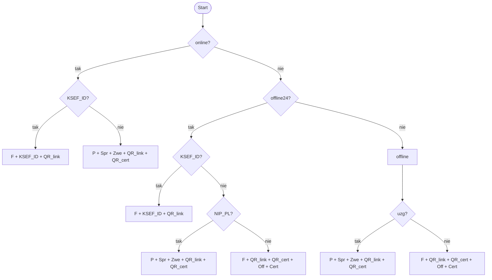
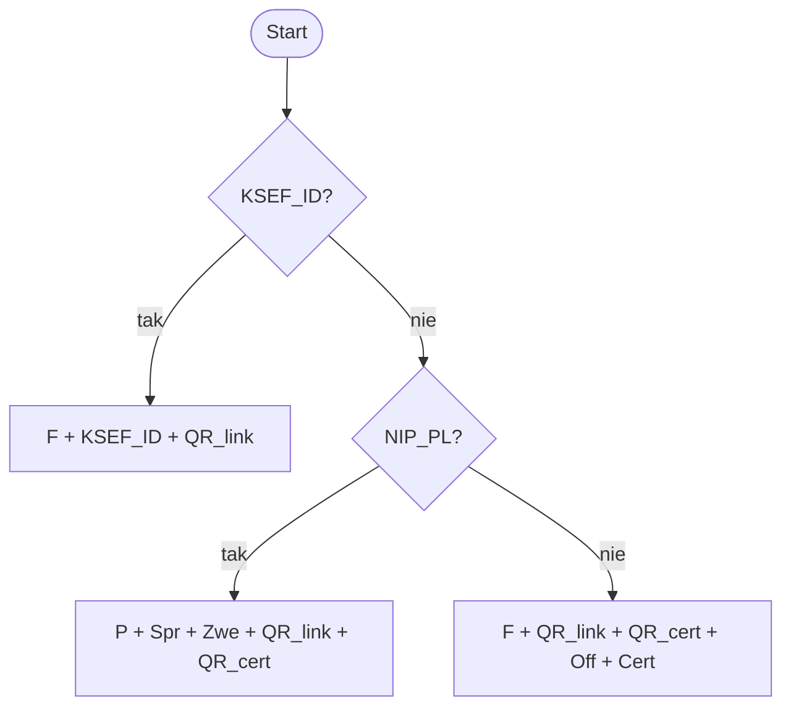

# Specyfikacja elementów graficznych wydruku faktury KSeF

Dokument opisuje logikę doboru elementów graficznych drukowanych na fakturze w zależności od trybu pracy systemu (online / offline24 / offline) oraz dostępności numeru KSeF i danych kontrahenta. Zawiera pseudo kod, diagramy decyzyjne, tabele oraz warunki widoczności poszczególnych pól.

> Dokument na podstawie wytycznych MF: [Potwierdzenie transakcji – KSeF](https://ksef.podatki.gov.pl/informacje-ogolne-ksef-20/potwierdzenie-transakcji/)

## Pseudo kod

> `F`, `P`, `KSEF_ID`, `Spr`, `Zwe`, `QR_link`, `QR_cert`, `Off`, `Cert` — elementy graficzne faktury

**Skróty**

| Skrót      | Opis                          |
|------------|-------------------------------|
| `F`        | Faktura                       |
| `P`        | Potwierdzenie transakcji      |
| `Spr`      | Sprawdź fakturę w KSeF        |
| `Zwe`      | Zweryfikuj wystawcę faktury   |
| `Off`      | OFFLINE                       |
| `Cert`     | CERTYFIKAT                    |

```
if (online) then
    if (KSEF_ID) then
        F + KSEF_ID + QR_link
    else
        P + Spr + Zwe + QR_link + QR_cert

else if (offline24) then
    if (KSEF_ID) then
        F + KSEF_ID + QR_link
    else
        if (NIP_PL) then
            P + Spr + Zwe + QR_link + QR_cert
        else
            F + QR_link + QR_cert + Off + Cert

else  -- offline
    if (uzg) then
        P + Spr + Zwe + QR_link + QR_cert
    else
        F + QR_link + QR_cert + Off + Cert
```

---

## Diagram (interpretacja)



### Tabela decyzyjna

| tryb       | KSEF_ID | NIP_PL | uzg | elementy na wydruku                      |
|------------|---------|--------|-----|------------------------------------------|
| online     | tak     | —      | —   | F + KSEF_ID + QR_link                    |
| online     | nie     | —      | —   | P + Spr + Zwe + QR_link + QR_cert        |
| offline24  | tak     | —      | —   | F + KSEF_ID + QR_link                    |
| offline24  | nie     | tak    | —   | P + Spr + Zwe + QR_link + QR_cert        |
| offline24  | nie     | nie    | —   | F + QR_link + QR_cert + Off + Cert       |
| offline    | —       | —      | tak | P + Spr + Zwe + QR_link + QR_cert        |
| offline    | —       | —      | nie | F + QR_link + QR_cert + Off + Cert       |

### Uproszczenie

> W trybie offline zakładamy — dla kontrahentów PL z NIP, że było uzgodnienie;
> w pozostałych przypadkach, że nie było. To pozwala sprowadzić logikę do:

```
if (KSEF_ID) then
    F + KSEF_ID + QR_link
else if (NIP_PL) then
    P + Spr + Zwe + QR_link + QR_cert
else
    F + QR_link + QR_cert + Off + Cert
```



| KSEF_ID | NIP_PL | elementy na wydruku                |
|---------|--------|------------------------------------|
| tak     | —      | F + KSEF_ID + QR_link              |
| nie     | tak    | P + Spr + Zwe + QR_link + QR_cert  |
| nie     | nie    | F + QR_link + QR_cert + Off + Cert |

### Warunki na drukowanie pól

| Element | KSEF_ID=tak | KSEF_ID=nie, NIP_PL=tak | KSEF_ID=nie, NIP_PL=nie | Drukuj gdy                |
|---------|:-----------:|:-----------------------:|:-----------------------:|---------------------------|
| `F`     | ✓           | —                       | ✓                       | `KSEF_ID or not(NIP_PL)`  |
| `P`     | —           | ✓                       | —                       | `not(KSEF_ID) and NIP_PL` |

| Element    | KSEF_ID=tak | KSEF_ID=nie, NIP_PL=tak | KSEF_ID=nie, NIP_PL=nie | Ukryj gdy       |
|------------|:-----------:|:-----------------------:|:-----------------------:|-----------------|
| `KSEF_ID`  | ✓           | —                       | —                       | `not(KSEF_ID)`  |

| Element    | KSEF_ID=tak | KSEF_ID=nie, NIP_PL=tak | KSEF_ID=nie, NIP_PL=nie | Ukryj gdy                  |
|------------|:-----------:|:-----------------------:|:-----------------------:|----------------------------|
| `Spr`      | —           | ✓                       | —                       | `KSEF_ID or not(NIP_PL)`   |
| `Zwe`      | —           | ✓                       | —                       | `KSEF_ID or not(NIP_PL)`   |
| `QR_link`  | ✓           | ✓                       | ✓                       | `false`                    |
| `QR_cert`  | —           | ✓                       | ✓                       | `KSEF_ID`                  |
| `Off`      | —           | —                       | ✓                       | `KSEF_ID or NIP_PL`        |
| `Cert`     | —           | —                       | ✓                       | `KSEF_ID or NIP_PL`        |

---

## Uwagi

1. Do wydruków KSeF można dodać adnotację, że prezentowany dokument jest jedynie wizualizacją — oryginał znajduje się w KSeF.

2. Wydaje się, że najlepszą opcją ze względu na stopień skomplikowania  jest zrobienie osobnego wydruku dla faktur spoza KSeF (detalicznych)

3. Jeśli jednak wydruk ma obsługiwać również faktury dla detalistów, należy wprowadzić parametr wejściowy trybu wydruku:

   | Wartość | Opis                                                                 |
   |---------|----------------------------------------------------------------------|
   | `True`     | Faktura KSeF — wydruki KSeF (domyślne elementy graficzne)                 |
   | `False`     | Faktura poza KSeF (detalista) — elementy graficzne charakterystyczne dla KSeF wyłączone |


4. Parametr trybu wydruku wydaje się nie do uniknięcia — dla faktury detalicznej niewysłanej jeszcze do KSeF nie da się przewidzieć, która sytuacja wystąpi:

   a. Faktura zostanie wysłana do KSeF — należy wydrukować kody QR i pozostałe elementy graficzne.
   b. Faktura nie zostanie wysłana do KSeF — drukujemy zwykłą fakturę bez tych elementów.

   Można natomiast zabezpieczyć program tak, aby w przypadku gdy faktura ma już nadany numer KSeF, a użytkownik wybrał tryb `False` (detalista), program mimo to wydrukował niezbędne elementy graficzne.

